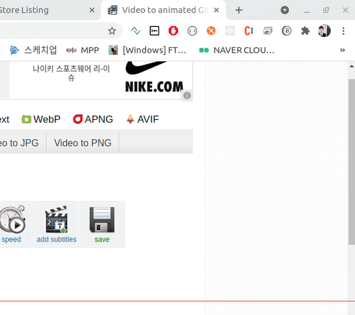
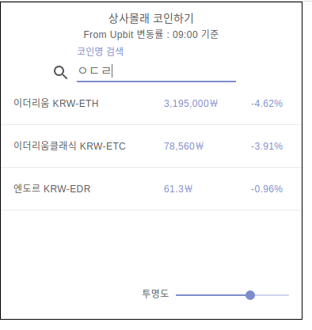
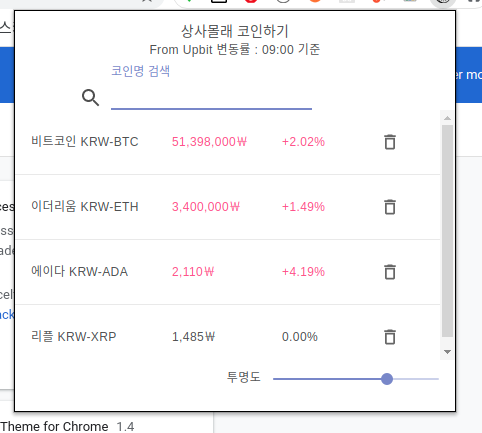

# Chrome Coin
- 크롬 익스텐션 : 상사몰래 코인하기
- 실시간 코인 가격 확인 애플리케이션 ( From Upbit API )
- 즐겨찾기 기능 추가 예정

## Install
```
$ yarn install
$ yarn start
```

## Browser Support
- Chrome

## Issue
- 업비트 원화마켓 상장 코인 지원
- 초당 5회 가격 정보 업데이트
- 현재 크롬 웹스토어 게시중
- https://chrome.google.com/webstore/detail/chromecoin/anjndelckdpnnpkcpokehhedocobkloh

## 변경 내용
- 20.05.17 : 변동률이 0.00%일때 붉은 글자로 표현되는 현상 수정
- 20.05.18 : 변동률 추가 수정
- 20.05.20 : 투명도 조절 기능, 초성검색 기능 추가, 즐겨찾기 기능 추가
- 20.05.21 : Table UI수정. padding 제거
## Demo





